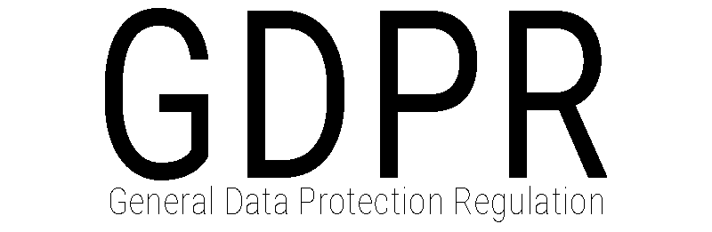

# awesome-GDPR 

Awesome GDPR resources and tools for privacy professionals.

## Contents
  * [Overview of the General Data Protection Regulation](#Overview-of-GDPR)
  * [Guidelines](#Guidelines)
  * [Books, blogs & papers](#books-blogs--papers)
  * [Data Protection Impact Assessments (DPIA)](#data-protection-impact-assessments-dpia)
  * [Incident management](#incident-management)
  * [Organisations / Projects](#organisations--projects)
  * [Solutions providers](#Solutions-providers)
  * [Related Awesome lists](#related-awesome-lists)

## Overview of GDPR
  * [GDPR-info](https://gdpr-info.eu/) - GDPR linked to relevant articles and section in the preamble.
  * [GDPR-expert](https://www.gdpr-expert.com/home.html?mid=5) - Compare the Regulation, Directive and National legislation. Linked to relevant section in preamble.
  
## Guidelines
  * EDPB: [Guidelines](https://edpb.europa.eu/our-work-tools/general-guidance/gdpr-guidelines-recommendations-best-practices_en) & [Opinions](https://edpb.europa.eu/our-work-tools/consistency-findings/opinions_en)
  * [ICO: Guide to GDPR](https://ico.org.uk/for-organisations/guide-to-data-protection/guide-to-the-general-data-protection-regulation-gdpr/)
  
## Books, blogs & papers
  * [GDPR Today](https://www.gdprtoday.org/) - Privacy news from the Open Rights Group.
  * [Spread Privacy](https://spreadprivacy.com/) - DuckDuckGo Blog.
  
## Data Protection Impact Assessments (DPIA)
  * [Open-source DPIA software from the French DPA](https://www.cnil.fr/en/open-source-pia-software-helps-carry-out-data-protection-impact-assesment)
  * [Guidelines on Data Protection Impact Assessment (WP29)](https://ec.europa.eu/newsroom/article29/item-detail.cfm?item_id=611236)
  * [ISO-standard: Guidelines for privacy impact assessment](https://www.iso.org/standard/62289.html)
  
## Incident management
  * [ENISA: Recommendations for a methodology of the assessment of severity of personal data breaches](https://www.enisa.europa.eu/publications/dbn-severity)
  * [Google, SRE: Managing Incidents](https://landing.google.com/sre/sre-book/chapters/managing-incidents/)
  * [Troy Hunt: Data breach disclosure 101](https://www.troyhunt.com/data-breach-disclosure-101-how-to-succeed-after-youve-failed/)
  * [Awesome Incident Response](https://github.com/meirwah/awesome-incident-response)
  * [GDPR Enforcement Tracker](http://www.enforcementtracker.com/) - overview of fines and penalties.
  
## Organisations / Projects
  * [European Data Protection Board](https://edpb.europa.eu/)
  * [European Data Protection Supervisor](https://edps.europa.eu/)
  * [Electronic Frontier Foundation](https://www.eff.org/)
  * [International Association of Privacy Professionals](https://iapp.org/)
  * [European Union Agency for Network and Information Security (ENISA)](https://www.enisa.europa.eu/topics/data-protection)
  * [Privacy International](https://www.privacyinternational.org)
  * Data Protection Authorities: [United Kingdom](https://ico.org.uk/) - [France](https://www.cnil.fr/en/home) - [Norway](https://www.datatilsynet.no/en/) - [Denmark](https://www.datatilsynet.dk/english/)
  * [NOYB](https://noyb.eu/)
  * [GDPR.eu](https://gdpr.eu/)
  * [CyLab Usable Privacy and Security Laboratory](http://cups.cs.cmu.edu/)
  
## Solutions providers
  * [OneTrust](https://www.onetrust.com/)
  * [TrustArc](https://www.trustarc.com/)
  * [Privitar](https://www.privitar.com/)
  * [BigID](https://bigid.com/)
  * [Wirewheel](https://wirewheel.io)
  * [Collibra](https://www.collibra.com)
    
## Related
  * [Privacy Respecting](https://github.com/nikitavoloboev/privacy-respecting)
  * [Awesome: Security](https://github.com/sindresorhus/awesome#security)

## License

To the extent possible under law, Harald O. Bakke has waived all copyright and related or neighboring rights to this work.
